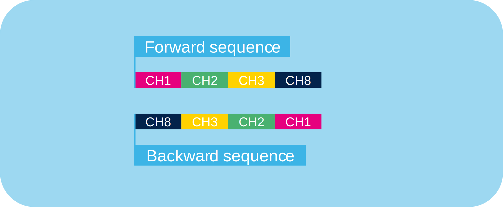
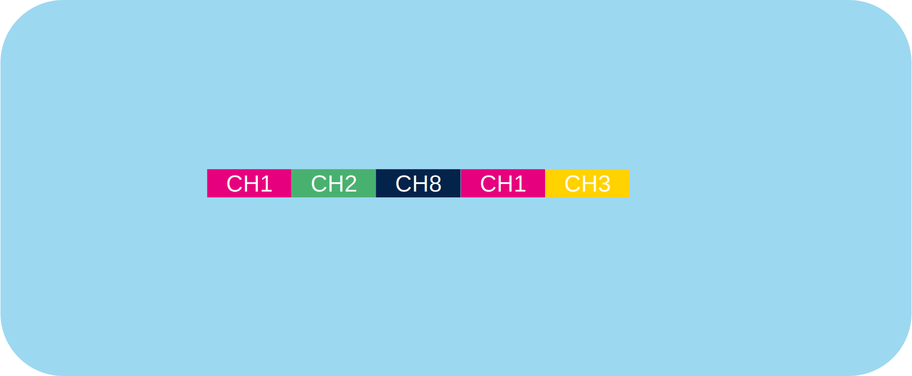
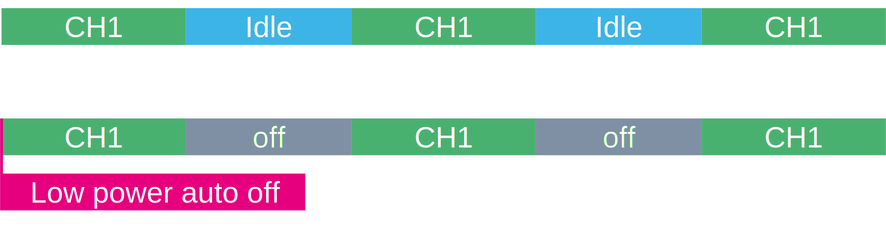

# STM32U5 ADC4 differences

Up to 12bit

## Sequencer

* Not fully configurable
* Fully configurable

### Not fully configurable

The ADC seqeunce can be set Forward/Backward
Over all the channels if wanted

### Fully configurable 

Seqeunce can bse set randomly.
8 item seqeunce. 
Only channels 1-16.

## Low power Auto off

The ADC is disabled when not converting or sample, This will reduce power consumption. 

## Shared sampling time

On ADC4 only two sampling times are possible. User can select for each channel one fo those sampling times. 

## Autonomous mode

The ADC4 when triggered is wwoken up from lowe power mode. Request clock. When ready a conversion is done. After that ADC hgoas back to low power mode. And clocks are disabled. 

