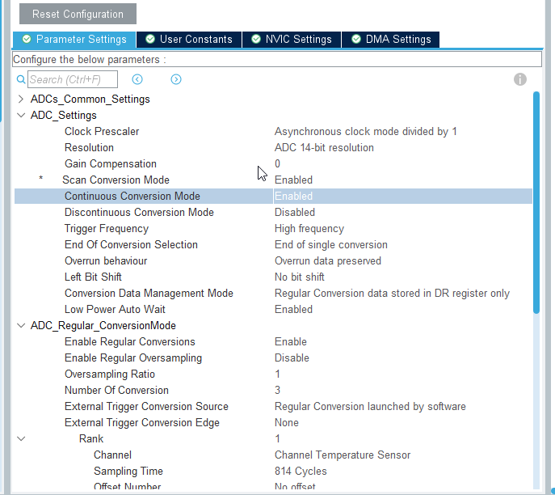
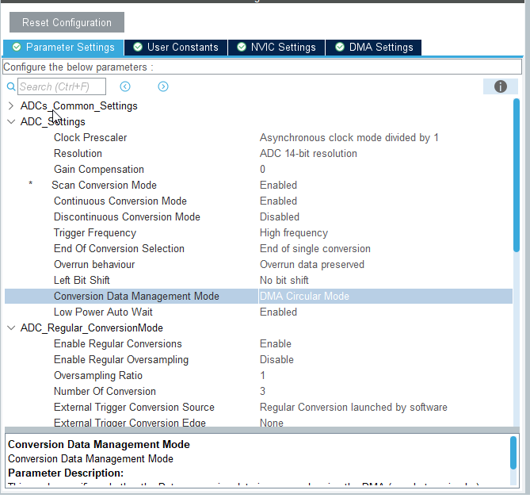
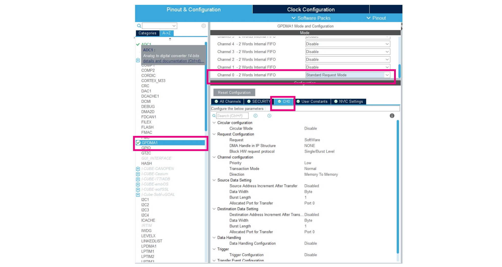
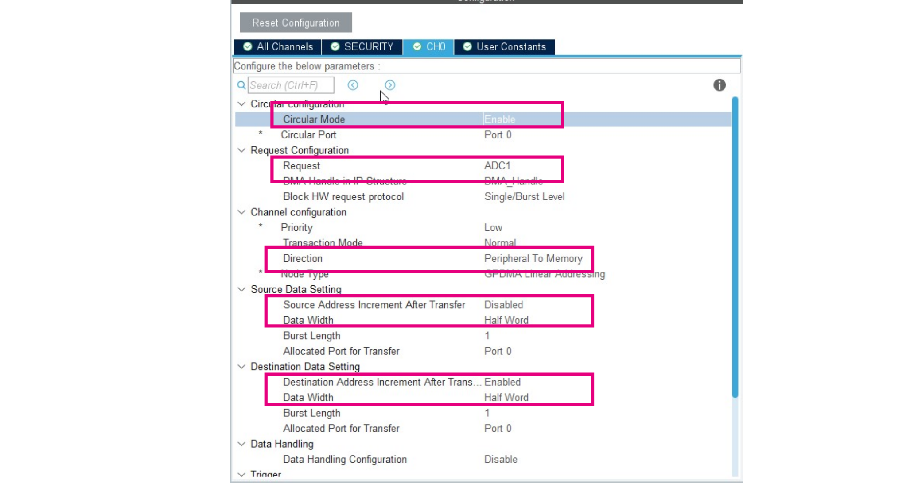

# Continuous scan mode and dma - CubeMX

Now we will use DMA to read data from ADC. So the core will not need to handle it. 

Im ADC config 
1. Set `continuous conversion mode` to **ENABLE**

2. Set `Conversion Data Management Mode` to **DMA Curcular Mode
**

2. Open GPDMA

The minimum settings as the legacy STM32 will be

- Circular mode
- Reqeust
- Priority
- Direction
- Source address increment after transfer
- Source Data width
- Destination address increment after transfer
- Destination Data width

3. Set `Circular mode` to **ENABLE**
4. Set `Request` to **ADC1**
5. Set `Direction` to **Periphery to memory**
6. Set `Source address increment after transfer` to **DISABLE**
7. Set `Source Data Wdith` to **Half Word**
8. Set `Destination address increment after transfer` to **ENABLE**
9. Set `Destination Data Wdith` to **Half Word**

10. Generate code