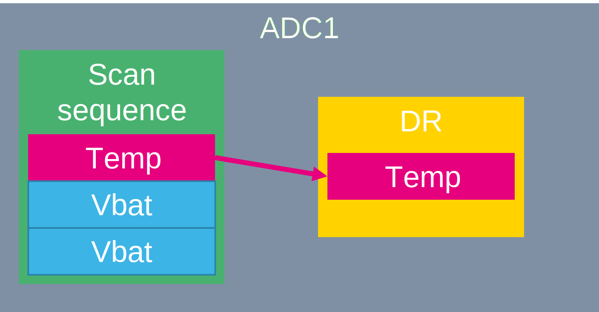
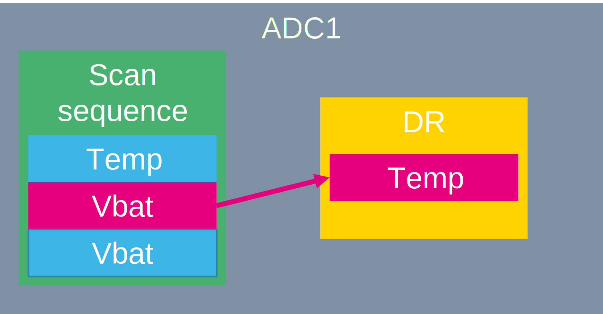
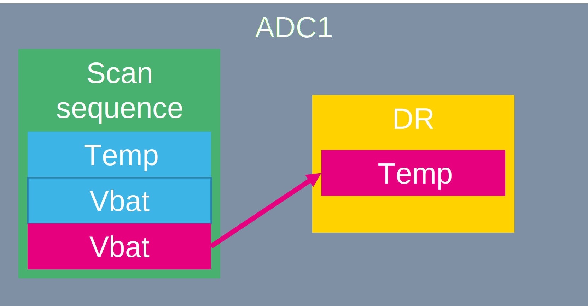
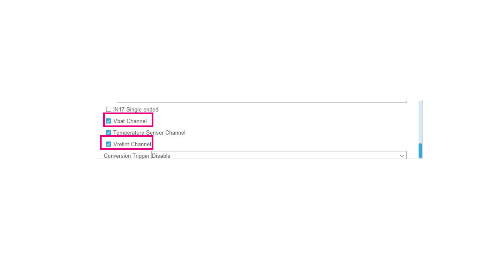
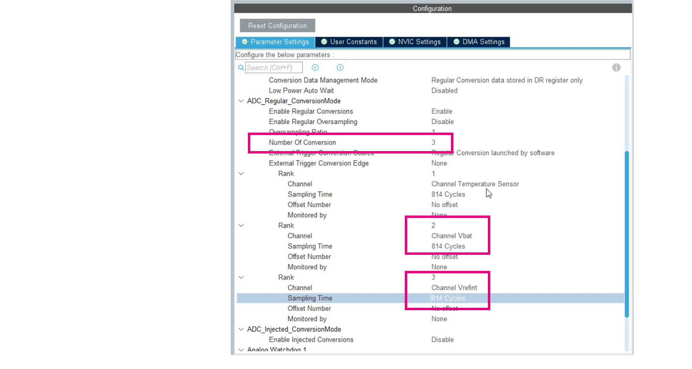
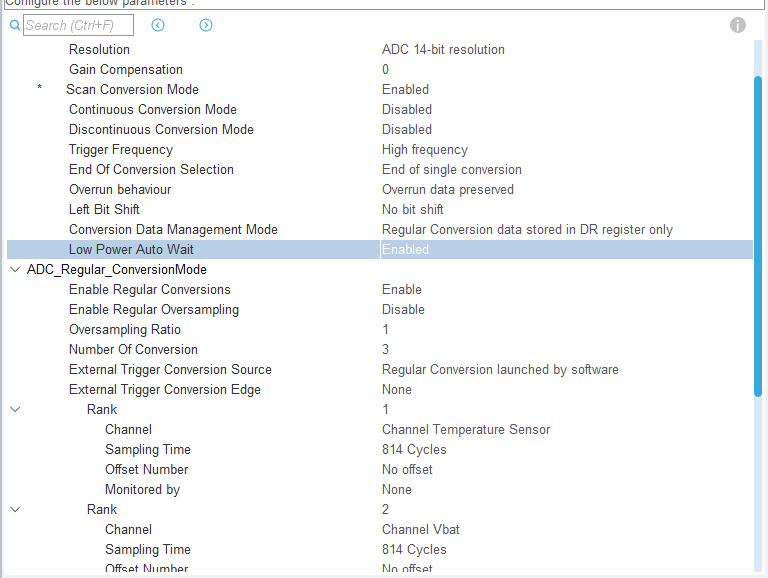

# Scan ADC - CubeMX

We create a seqeunce to convert three channels

We will ad a new hcannel to our regular seqeunce. 

1. Enable `Vrefint channel `and `Vbat channel`

2. Set `Number of Conversion` to **3**

This will enable the scan mode. Now our seqeunce have 3 items

3. Set Rank 2 `Channel` to **Vbat channel**
4. Set `Sampling time` to **814 cycles**
5. Set Rank 3 `Channel` to **Vrefint channel**
6. Set `Sampling time` to **814 cycles**

To prevend of data overrun we enable `Low Power Auto Wait`. 

7. set `Low Power Auto Wait` to **ENABLE** 
   

8. Generate code