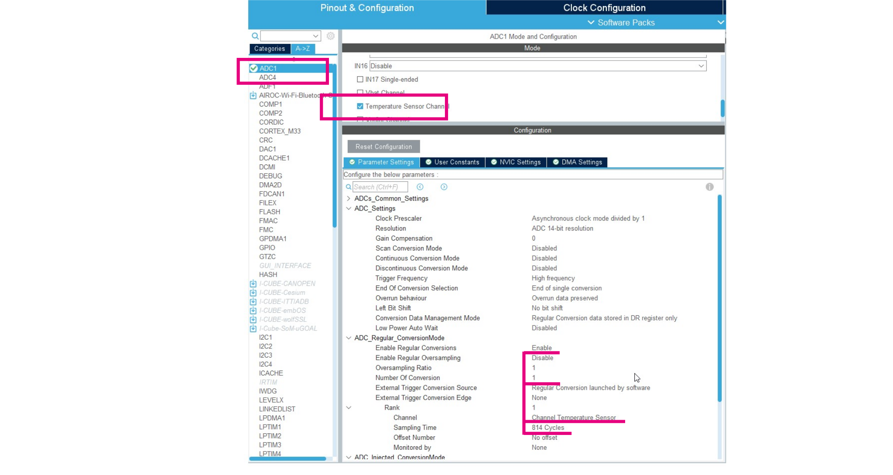

# Simple ADC - CubeMX 

1. Select ADC1
2. Select temperature sensor. 

In Configuration

3. Set `Enable regular conversion` to **ENABLE**
4. Set `Number of conversions` set to **1**
5. Open Rank 1 - first item in sequence
6. Set `Channel` to **Cahnnel temperature sensor**
7. Set `Sampling Time` to **814 cycles**

8. Generate code
