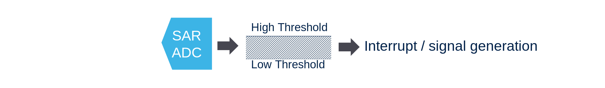

# Analog watchdog

## Tresholds

define a `High` and `Low` treshold where the values wil be checked. 
If value is undr low treshold or above high treshold a interrupt can be triggered. 

## Chanel checking

A watchdog 2/3 can be assinged to regular channels. 

the watchdog 1 can watch all channels or also injected channels. 

## Filtering

The watchdog 1 support filtering where the value must be out of range fro multiple samples to be taken into account 

