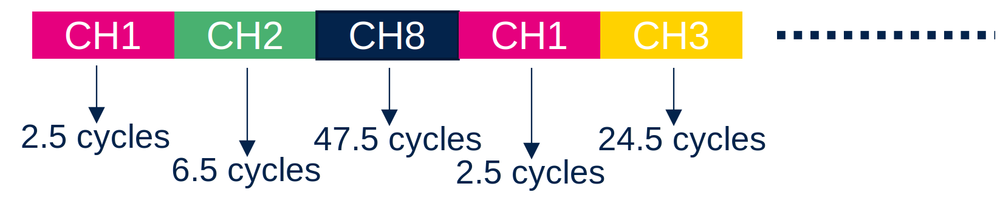

# Regular conversion

Is defined by number of conversion in the regular conversion sequence

Seqeunce can be up to 16items. 

for each seqeunce element is possible to select:

* Sampling time
* Channel
* Rank 
* Offset
* Monitored by

## Sampling time

Define how many long ADC is sampling input channel

## Cahnnel 

Input cahnnel where the sample will be taken

## Rank

Position in seqeunce
starting from 1. Up to `number of onversion`

## Offset

The ADC have 4 offset units which can be used for 4 channels. 

## Monitored by - Analog watchdog

Select analog watchdog which will wtch this channel 

