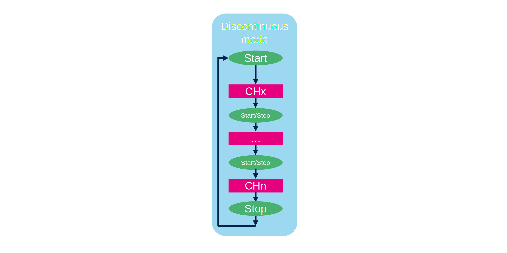

# ADC (regular) conversion modes

In this part we will focus on three options:
* SCAN mode
* CONT mode (continuous)
* DISC mode (discontinous)

# Single conversion

Setup:
* SCAN = 0 
* CONT = 0
* DISC = 0

Only one conversion is performed then adc is stopped

# Single continuous conversion

Setup:
* SCAN = 0 
* CONT = 1
* DISC = 0

the same channel is continously samples, adc newer stops

# Scan Conversion Mode

Setup:
* SCAN = 1
* CONT = 0
* DISC = 0

A scheduler is used to configue order of conversions. 
ADC 1/2 up to 16 item seqeunce

# Continuous Scan Conversion Mode

Setup:
* SCAN = 1 
* CONT = 1
* DISC = 0

Same as previous but repead the schedule

# Discontinous Conversion Mode

Setup:
* SCAN = 1 
* CONT = 1
* DISC = 1

A mode when scan stop after set number of conversion in seqeunce and wait for new start/triffer. 

