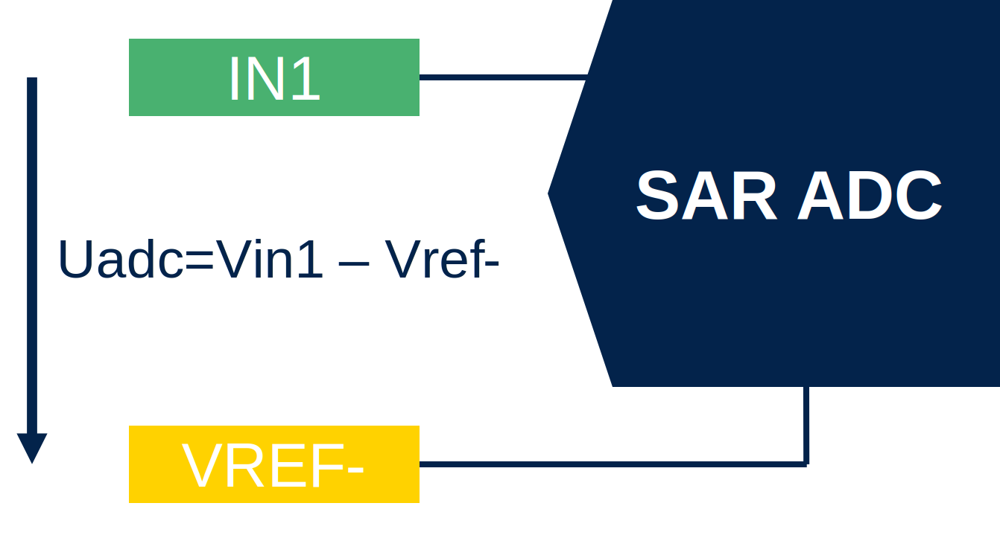
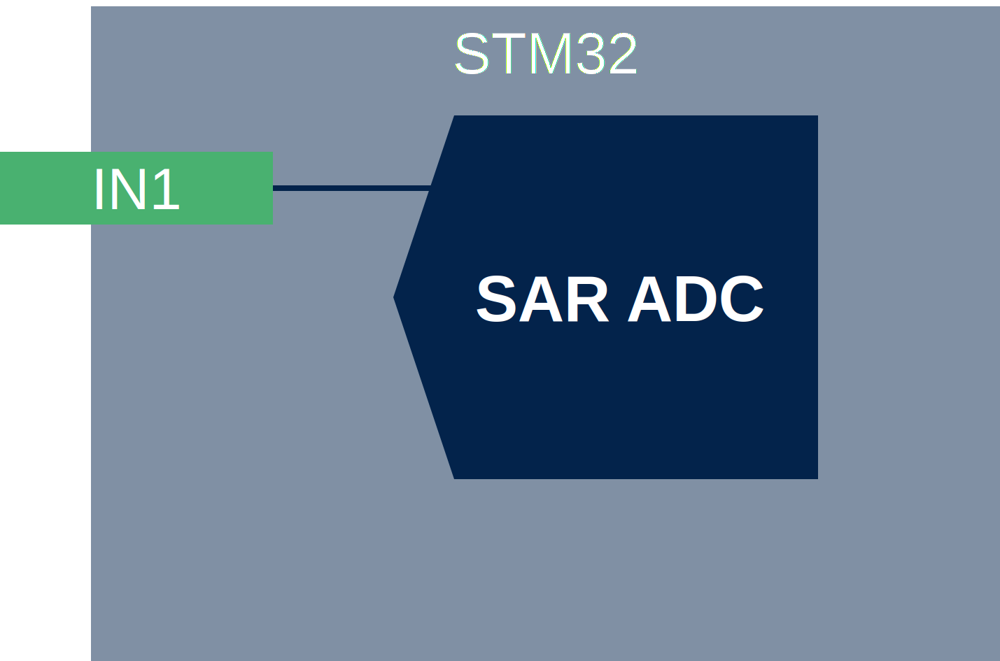
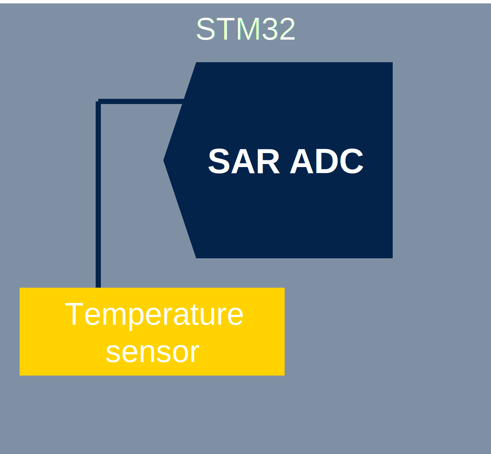

# ADC inputs

Cahnnles connection can be found in RM.

## ADC input hcannels

### Single ended input channel

Adc will conver voltage where the low level is Vref-.

### Differential input channel

**Only ADC1/2**
Device will conver the voltage given by difference between Vin1-Vrin2

## Channel types

### External inputs

This inputs are dirreclty connect to GPIO pins of the STM32
The pin mode must be set to `Analog`

### Internal inputs

The ADC input is conneected to internal peripheries of STM32
Typically some internal referential voltages can be read. 
Or temperature sensor

