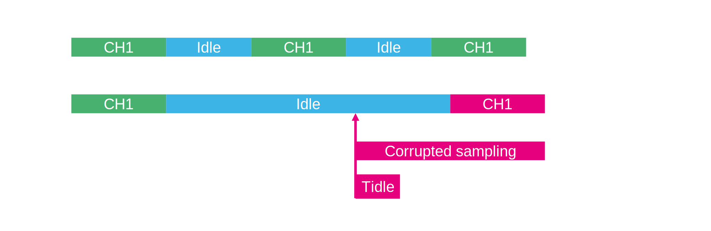
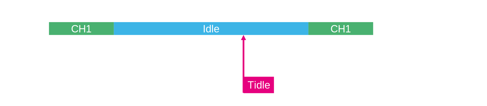

# Trigger frequency

## Trigger limitation

After the adc finish conversion it goad to indle state and wating for new trigger or start for new conversion. 
If the time is longer thant the Tidle dou to internal leackage the sampling capacitor is influenced and next value may be corrupted. 

For this is possible to use 

* Low freqeuncy option

